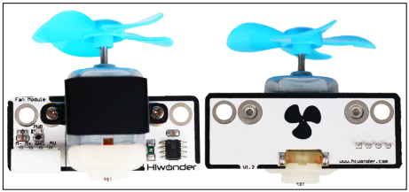
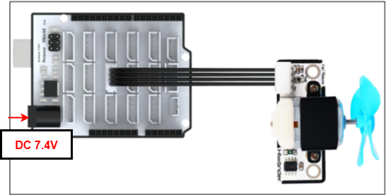
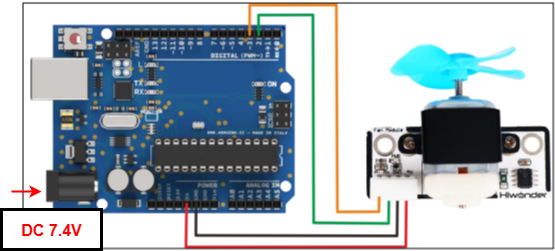

# 2. Arduino Development



## 2.1 Getting Started

### 2.1.1 Wiring Instruction

This section illustrates connecting a 4-pin cable to the A2 and A3 ports on the Arduino expansion board. Refer to the diagram below.



If you do not have an Arduino expansion board, use a Dupont wire to directly connect to the Arduino development board, just as below:



> [!NOTE]
>
> * **When using Hiwonder's lithium battery, connect the battery cable with the red wire to the positive (+) terminal and the black wire to the negative (–) terminal of the DC port.**
>
> * **If the battery is not connected to the cables, do not connect the cable ends directly together. Doing so may cause a short circuit and damage the system.**
>
> * **Before powering on, ensure that no metal objects are touching the controller. Otherwise, the exposed pins at the bottom of the board may cause a short circuit and damage the controller.**

### 2.1.2 Environment Configuration

You can install the Arduino IDE on a PC. Download path: "**[Appendix->Arduino Installation Package](https://drive.google.com/drive/folders/1BdDIiEdZ7I7S4KnQ92iSyUhA2H-Z8Ugo?usp=sharing)**." For more information, please refer to the same directory.

## 2.2 Test Case

Program to control the rotation of the fan.

### 2.2.1 Program Download

1. <span class="mark">Connect the Arduino UNO development board with the expansion board to the computer via a USB cable. Open the Arduino IDE, click "**File -\> New,**" and import the program from the same directory as this tutorial.</span>

2. Remember to select the correct development board and port to compile and upload the program, the ports below are for reference only.

   

3. After the code is uploaded, click  to open the serial monitor, set the baud rate to 9600 to observe the output.

### 2.2.2 Project Outcome

The fan module cycles through the following sequence, each lasting 2 seconds: full-speed clockwise rotation, stop, half-speed clockwise rotation, and half-speed counterclockwise rotation.

### 2.2.3 Program Brief Analysis

- **Custom interfaces**

```c++
#define M1 2 //The fan sensor's M+ is connected to 2 on the control board
#define M2 3 //The fan sensor's M- is connected to 3 on the control board
int8_t MSpeed = 0;
uint8_t Dir = 0;
```

Set up the fan sensor interface with the two PWM direction pins connected to pins 2 and 3. Mspeed sets the fan speed, and Dir sets the rotation direction.

- **Serial Port Initialization**

```c++
void setup()
{
	pinMode(M1, OUTPUT)；
	pinMode(M2, OUTPUT);
    InitTimer2:
}
```

The interface is initialized to output mode.

- **Initialize Timer 2**

```c++
void InitTimer2()
{
  TCCR2A= 0;
  TCCR2B=_BV(CS21)|_BV(CS20);
  TIMSK2=_BV(TOIE2);
  TCNT2=206;
  sei();
}
```

- **Interrupt Service Routine**

```c++
ISR(TIMER2_OVF_vect)
{
  TCNT2=206; //Timer interrupt  100us
  MotorPwmCtrl();
}
```

- **Fan speed control**

```c++
void MotorControl(int8_t Speed)  //Function to control fan speed
{
  if (Speed >= 0)
  {
    Dir = 1;
    
  }
  Else	
  {
    Dir = 0;
    
  }
  MSpeed /= 10;
}
```

Convert any negative value of the parameter "**Speed**"to positive, and use the "**Dir**" variable to indicate the fan's rotation direction. For example: Speed= -70; Set Dir to 0, the fan will rotate counterclockwise and the rotation speed should be 70.

- **Fan rotation PWM control**

```c++
void MotorPwmCtrl(void)  //Function to control fan speed
{
  static uint8_t time = 0;

  if (time < MSpeed)
  {
    if (Dir)
    {
      digitalWrite(M1, HIGH);
      digitalWrite(M2, LOW);
    }
    else
    {
      digitalWrite(M2, HIGH);
      digitalWrite(M1, LOW);
    }
  }
  else
  {
      digitalWrite(M1, LOW);
      digitalWrite(M2, LOW);
  }

  if (++time >= 10)
  {
    time = 0;
  }
}
```

Control the fan rotation direction by sending high and low signals to two pins, generating PWM signals to drive the fan motor.

- **Main Function**

```c++
void loop() {
  static uint32_t timer;
  static uint8_t n = 0;
  if (timer > millis())
    return;
  if (n == 0)
  {
    MotorControl(70);
    timer = millis() + 2000;
    n = 1;
  }
  else if (n == 1)
  {
    MotorControl(0);
    timer = millis() + 2000;
    n = 2;
  }
  else if (n == 2)
  {
    MotorControl(-70);
    timer = millis() + 2000;
    n = 3;
  }
  else if (n == 3)
  {
    MotorControl(0);
    timer = millis() + 2000;
    n = 0;
  }
```

Use conditional statements to set the fan speed, and continuously generate PWM signals with different duty cycles in the main loop.