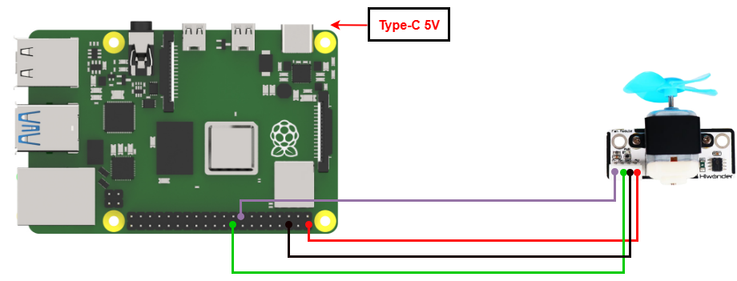

# 3. Raspberry Pi Development Tutorial


## 3.1 Getting Started

### 3.1.1 Wiring Instruction

When wiring, connect the digital tube’s 5V、GND、M+（GPIO 24）and M-（GPIO 22）pins to the corresponding pins on the Raspberry Pi.



> [!NOTE]
>
> * **When using Hiwonder's lithium battery, connect the battery cable with the red wire to the positive (+) terminal and the black wire to the negative (–) terminal of the DC port.**
>
> * **If the battery is not connected to the cables, do not connect the cable ends directly together. Doing so may cause a short circuit and damage the system.**
>
> * **Before powering on, ensure that no metal objects are touching the controller. Otherwise, the exposed pins at the bottom of the board may cause a short circuit and damage the controller.**

### 3.1.2 Environment Configuration

Install NoMachine on your computer. The software package is located under **"[Appendix-> Remote Desktop Connection Tool](https://drive.google.com/drive/folders/19xwB23kbxV4nDW6lO6n2MHFO8LitJu3n?usp=sharing)"**. For the detailed operations of NoMachine, please refer to the same directory.

Drag the program and SDK library files into the Raspberry Pi system image. For demonstration, the files are placed on the Desktop in this example. 

> [!NOTE]
>
> **Make sure the library files are placed in the same directory as the program.**

Open the terminal and enter the command to change to the program directory: 

```bash
sudo chmod a+x Sensor_Demo/
```

## 3.2 Test Case

Program to control fan rotation.

### 3.2.1 Program Download

1. Open the terminal and enter the command to navigate to the program directory, enter: **cd Desktop/Sensor_Demo/**, then press Enter.

```bash
cd Desktop/Sensor_Demo/
```

2. To run this example program, enter: 

```bash
python3 FanControDemo.py
```

### 3.2.2 Project Outcome

The fan module cycles through the following sequence, each lasting 2 seconds: full-speed clockwise rotation, stop, half-speed clockwise rotation, and half-speed counterclockwise rotation.

### 3.2.3 Program Brief Analysis

- **Import Libraries**

```py
#!/usr/bin/env python3
import os
import sys
import time
import RPi.GPIO as GPIO
```

- **Serial Port Initialization**

```py
GPIO.setwarnings(False)
GPIO.setmode(GPIO.BCM)
```

Disable the GPIO module warning message and set the pin mode to BCM numbering.

- **Check the running Python version**

```py
if sys.version_info.major == 2:
    print('Please run this program with python3!')
    sys.exit(0)
```

Check if the running Python version is 3.0 or higher.

If yes, the program runs normally; if not, it prints a message via the print() function and exits.

- **Control the fan rotation through high and low levels**

Set the fan to run clockwise, stop, run counterclockwise, and stop again, each for 2 seconds, in a continuous cycle until the program stops.

```py
while(1):

    ## Initialize pin mode (初始化引脚模式)
    GPIO.setup(22, GPIO.OUT) # Set pin as output mode (设置引脚为输出模式)
    GPIO.setup(24, GPIO.OUT)

    ## Turn on fan (开启风扇)
    GPIO.output(22, 1)     # Set pin output to high level (设置引脚输出高电平)
    GPIO.output(24, 0)     # Set pin output to low level (设置引脚输出低电平)

    ## Delay 2 seconds (延时2秒)
    time.sleep(2)

    ## Turn off fan (关闭风扇)
    GPIO.output(22, 0)
    GPIO.output(24, 0)
    
    ## Delay 2 seconds (延时2秒)
    time.sleep(2)
    ## Turn on the fan (开启风扇)
    GPIO.output(22, 0)     # Set pin output to high level (设置引脚输出高电平)
    GPIO.output(24, 1)     # Set pin output to low level (设置引脚输出低电平)

    ## Delay 2 seconds (延时2秒)
    time.sleep(2)

    ## Turn off fan (关闭风扇)
    GPIO.output(22, 0)
    GPIO.output(24, 0)
    ## Delay 2 seconds (延时2秒)
    time.sleep(2)
```

1. GPIO.setup(22, GPIO.OUT)

   GPIO.setup(24, GPIO.OUT)

   Set IO22 and 24 pins to output mode.

2. GPIO.output(22, 1)

   GPIO.output(24, 0)

   Set pin 22 to HIGH and pin 24 to LOW, and the fan rotates clockwise.

3. GPIO.output(22, 0)

   GPIO.output(24, 1)

   Set pin 22 to LOW and pin 24 to HIGH, and the fan rotates counterclockwise.

4. GPIO.output(22, 0)

   GPIO.output(24, 0)

   Set pin 22 and pin to LOW, and the fan stops.