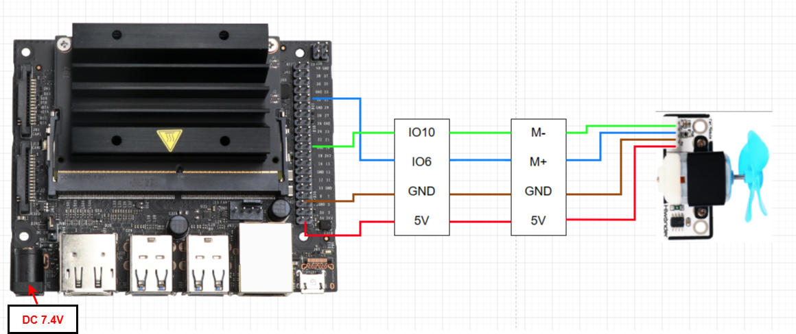

# 4. Jetson Development


## 4.1 Getting Started

### 4.1.1 Wiring Instruction

This section uses DuPont wires to connect fan modules. For wiring instructions, refer to the figure below:



<table class="docutils-nobg" border="1">
<colgroup>
<col style="width: 20%" />
<col style="width: 20%" />
<col style="width: 20%" />
<col style="width: 20%" />
<col style="width: 20%" />
</colgroup>
<tbody>
<tr>
<td colspan="5" style="text-align: center;">
<strong>Connection diagram</strong>
</td>
</tr>
<tr>
<td style="text-align: center;">
<strong>Item</strong>
</td>
<td style="text-align: center;">
<strong>Pin</strong>
</td>
<td style="text-align: center;">
<strong>Motor Connection Type</strong>
</td>
<td style="text-align: center;">
<strong>Item</strong>
</td>
<td style="text-align: center;">
<strong>Pin</strong>
</td>
</tr>
<tr>
<td style="text-align: center;">
Jetson Nano
</td>
<td style="text-align: center;">
IO10
</td>
<td style="text-align: center;">
Dupont wire
</td>
<td style="text-align: center;">
Fan Module
</td>
<td style="text-align: center;">
M-
</td>
</tr>
<tr>
<td style="text-align: center;">
Jetson Nano
</td>
<td style="text-align: center;">
IO6
</td>
<td style="text-align: center;">
Dupont wire
</td>
<td style="text-align: center;">
Fan Module
</td>
<td style="text-align: center;">
M+
</td>
</tr>
<tr>
<td style="text-align: center;">
Jetson Nano
</td>
<td style="text-align: center;">
GND
</td>
<td style="text-align: center;">
Dupont wire
</td>
<td style="text-align: center;">
Fan Module
</td>
<td style="text-align: center;">
GND
</td>
</tr>
<tr>
<td style="text-align: center;">
Jetson Nano
</td>
<td style="text-align: center;">
5V
</td>
<td style="text-align: center;">
Dupont wire
</td>
<td style="text-align: center;">
Fan Module
</td>
<td style="text-align: center;">
5V
</td>
</tr>
</tbody>
</table>

> [!NOTE]
>
> Before powering on, ensure that no metal objects are touching the controller. Otherwise, the exposed pins at the bottom of the board may cause a short circuit and damage the controller.

### 4.1.2 Environment Configuration

Install NoMachine software on PC. The software package is stored in **"[Appendix-> Remote Desktop Connection Tool](https://drive.google.com/drive/folders/19xwB23kbxV4nDW6lO6n2MHFO8LitJu3n?usp=sharing)"**. For the detailed operations of NoMachine, please refer to the relevant tutorials.

**Drag the program into the Jetson Nano system image, in this example, the files are placed on the Desktop for demonstration.**

## 4.2 Test Case

Program to control the fan module’s forward and reverse rotation.

### 4.2.1 Program Download

1. Open the remote desktop and drag the program into it, then open the terminal, enter  to switch to the directory where the program is located, and press Enter.

```bash
cd Desktop/
```

2. Enter to run the program in this case.

```bash
python3 FanControlDemo.py
```

### 4.2.2 Project Outcome

The fan module rotates forward for 1 second and then stops for 2 seconds. It then rotates in reverse for 1 second, stops for 2 seconds, and repeats this cycle.

### 4.2.3 Program Brief Analysis

* **Import Libraries**

```py
import time
import Jetson.GPIO as GPIO
```

Import the library files required by the program, including the library files needed for delay and the library files for using GPIO pins on the Jetson controller.

- **Initialization Sequence**

```py
def main():
    # Initialize GPIO pins (初始化io口)
    GPIO.setmode(GPIO.BCM)
    GPIO.setup(10, GPIO.OUT)
    GPIO.setup(6, GPIO.OUT)
    GPIO.output(10, 0)
    GPIO.output(6, 0)
```

Initialized the fan's GPIO port and set the GPIO mode to BCM mode. Set pins 10 and 6 for the fan module and configure them as output.

- **Main Function**

```py
while True:
        #Rotate forward for one second (正转一秒钟)
        GPIO.output(10, 0)
        GPIO.output(6, 1)
        time.sleep(1)
        #Pause for two seconds (暂停两秒钟)
        GPIO.output(10, 0)
        GPIO.output(6, 0)
        time.sleep(1)
        #Rotate backward for one second (反转一秒钟)
        GPIO.output(10, 1)
        GPIO.output(6, 0)
        time.sleep(1)     
        #Pause for two seconds (暂停两秒钟)
        GPIO.output(10, 0)
        GPIO.output(6, 0)
        time.sleep(1)    
```

Set the fan module's GPIO pins 10 and 6 to different high and low levels in the while loop. For example, if pin 10 is set to low level and pin 6 is high level, the fan will rotate clockwise, otherwise it will rotate in reverse. Set both pins to low level, and the module stops rotating.